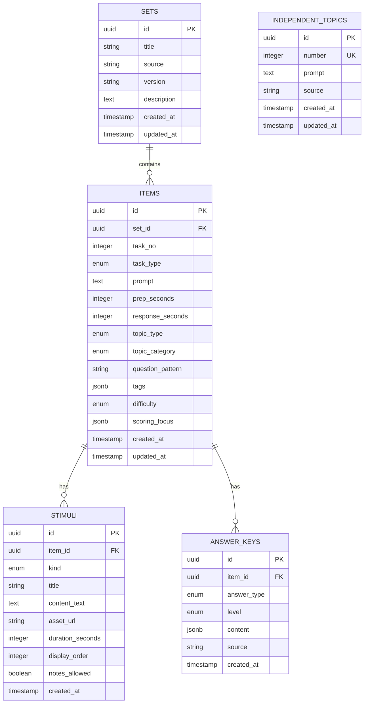

# 데이터베이스 스키마 문서

## 개요

TOEFL Speaking Rater의 PostgreSQL 데이터베이스 스키마는 정규화된 설계를 따르며, 5개의 핵심 테이블로 구성됩니다.

### 핵심 설계 원칙

- **정규화 설계**: 데이터 중복 최소화 및 무결성 보장
- **외래 키 제약**: CASCADE 삭제로 참조 무결성 유지
- **인덱스 최적화**: 빈번한 쿼리 필드에 인덱스 설정
- **타임스탬프 추적**: 모든 테이블에 created_at, updated_at 자동 관리
- **JSONB 활용**: 유연한 메타데이터 저장 (tags, scoring_focus)

---

## 엔티티 관계 다이어그램 (ERD)



---

## 테이블 상세 스키마

### 1. sets - 문제 세트

문제 세트(Set)는 여러 개별 문항(Item)을 그룹화하여 관리합니다.

| 컬럼명 | 데이터 타입 | 제약조건 | 설명 |
|--------|------------|---------|------|
| **id** | UUID | PRIMARY KEY | 고유 식별자 |
| **title** | VARCHAR(200) | NOT NULL | 세트 제목 (예: "TPO 1 Speaking Set") |
| **source** | VARCHAR(100) | NOT NULL, INDEX | 출처 (예: "ETS Official", "Kaplan") |
| **version** | VARCHAR(20) | NOT NULL, INDEX | 버전 (예: "v1.0") |
| **description** | TEXT | NULLABLE | 세트 설명 |
| **created_at** | TIMESTAMP | NOT NULL, DEFAULT NOW() | 생성 시각 |
| **updated_at** | TIMESTAMP | NOT NULL, DEFAULT NOW() | 수정 시각 |

**관계:**
- `items`: 1:N (Set → Items, CASCADE DELETE)

**인덱스:**
- `ix_sets_source`: source 컬럼
- `ix_sets_version`: version 컬럼

---

### 2. items - 개별 문항

Item은 Set에 속하는 개별 문제를 나타냅니다. Independent와 Integrated 두 가지 유형이 있습니다.

| 컬럼명 | 데이터 타입 | 제약조건 | 설명 |
|--------|------------|---------|------|
| **id** | UUID | PRIMARY KEY | 고유 식별자 |
| **set_id** | UUID | FOREIGN KEY → sets.id, NOT NULL, INDEX | 소속 Set UUID |
| **task_no** | INTEGER | NOT NULL | Set 내 문항 번호 (1-4) |
| **task_type** | ENUM | NOT NULL, INDEX | 문항 유형 (INDEPENDENT, INTEGRATED) |
| **prompt** | TEXT | NOT NULL | 문제 지시문 |
| **prep_seconds** | INTEGER | NOT NULL, DEFAULT 15 | 준비 시간 (초) |
| **response_seconds** | INTEGER | NOT NULL, DEFAULT 45 | 응답 시간 (초) |
| **topic_type** | ENUM | NULLABLE, INDEX | 주제 유형 (Independent 전용) |
| **topic_category** | ENUM | NULLABLE, INDEX | 주제 카테고리 (Independent 전용) |
| **question_pattern** | VARCHAR(200) | NULLABLE | 질문 패턴 |
| **tags** | JSONB | NOT NULL, DEFAULT [] | 태그 목록 |
| **difficulty** | ENUM | NULLABLE, INDEX | 난이도 (easy, medium, hard) |
| **scoring_focus** | JSONB | NOT NULL, DEFAULT {} | 채점 가중치 |
| **created_at** | TIMESTAMP | NOT NULL, DEFAULT NOW() | 생성 시각 |
| **updated_at** | TIMESTAMP | NOT NULL, DEFAULT NOW() | 수정 시각 |

**관계:**
- `set`: N:1 (Items → Set)
- `stimuli`: 1:N (Item → Stimuli, CASCADE DELETE)
- `answer_keys`: 1:N (Item → AnswerKeys, CASCADE DELETE)

**제약조건:**
- `uq_items_set_task_no`: UNIQUE(set_id, task_no) - Set 내에서 task_no는 유일

**인덱스:**
- `ix_items_set_id`: set_id 컬럼
- `ix_items_task_type`: task_type 컬럼
- `ix_items_topic_type`: topic_type 컬럼
- `ix_items_topic_category`: topic_category 컬럼
- `ix_items_difficulty`: difficulty 컬럼

**Enum 타입:**
- `task_type_enum`: INDEPENDENT, INTEGRATED
- `topic_type_enum`: preference, agree_disagree, description, advantages_disadvantages, personal_experience
- `topic_category_enum`: education, technology, personal_development, social_relationships, work, leisure
- `difficulty_enum`: easy, medium, hard

---

### 3. stimuli - 자극자료

Stimulus는 Item에 제공되는 자료(읽기 지문, 음성, 이미지, 지시문)를 나타냅니다.

| 컬럼명 | 데이터 타입 | 제약조건 | 설명 |
|--------|------------|---------|------|
| **id** | UUID | PRIMARY KEY | 고유 식별자 |
| **item_id** | UUID | FOREIGN KEY → items.id, NOT NULL, INDEX | 소속 Item UUID |
| **kind** | ENUM | NOT NULL, INDEX | 자료 유형 (reading, audio, image, direction) |
| **title** | VARCHAR(200) | NULLABLE | 자료 제목 |
| **content_text** | TEXT | NULLABLE | 텍스트 내용 (reading, direction 용) |
| **asset_url** | VARCHAR(500) | NULLABLE | 미디어 URL (audio, image 용) |
| **duration_seconds** | INTEGER | NULLABLE | 음성 길이 (초, audio 전용) |
| **display_order** | INTEGER | NOT NULL, DEFAULT 0 | 표시 순서 |
| **notes_allowed** | BOOLEAN | NOT NULL, DEFAULT false | 노트 필기 허용 여부 |
| **created_at** | TIMESTAMP | NOT NULL, DEFAULT NOW() | 생성 시각 |

**관계:**
- `item`: N:1 (Stimuli → Item)

**인덱스:**
- `ix_stimuli_item_id`: item_id 컬럼
- `ix_stimuli_kind`: kind 컬럼

**Enum 타입:**
- `stimulus_kind_enum`: reading, audio, image, direction

---

### 4. answer_keys - 모범답안

AnswerKey는 Item에 대한 모범답안, 스크립트, 개요, 포인트, 또는 Blueprint를 저장합니다.

| 컬럼명 | 데이터 타입 | 제약조건 | 설명 |
|--------|------------|---------|------|
| **id** | UUID | PRIMARY KEY | 고유 식별자 |
| **item_id** | UUID | FOREIGN KEY → items.id, NOT NULL, INDEX | 소속 Item UUID |
| **answer_type** | ENUM | NOT NULL, INDEX | 모범답안 유형 |
| **level** | ENUM | NULLABLE, INDEX | 품질 수준 (high, mid, low) |
| **content** | JSONB | NOT NULL | 모범답안 내용 또는 Blueprint JSON |
| **source** | VARCHAR(100) | NULLABLE | 출처 (예: "ETS Official") |
| **created_at** | TIMESTAMP | NOT NULL, DEFAULT NOW() | 생성 시각 |

**관계:**
- `item`: N:1 (AnswerKeys → Item)

**인덱스:**
- `ix_answer_keys_item_id`: item_id 컬럼
- `ix_answer_keys_answer_type`: answer_type 컬럼
- `ix_answer_keys_level`: level 컬럼

**Enum 타입:**
- `answer_key_type_enum`: sample_response, transcript, outline, points, blueprint
- `answer_key_level_enum`: high, mid, low

**Content JSONB 구조:**

Sample Response:
```json
{
  "text": "I would like to talk about...",
  "word_count": 120,
  "notes": "Clear structure and good vocabulary"
}
```

Blueprint:
```json
{
  "structure_score": 3.5,
  "language_score": 4.0,
  "delivery_score": 3.0,
  "rubric": {
    "clarity": "High",
    "coherence": "Medium",
    "vocabulary": "Advanced"
  }
}
```

---

### 5. independent_topics - Independent 토픽 뱅크

Independent Speaking 문제에 사용할 수 있는 토픽 목록을 관리합니다.

| 컬럼명 | 데이터 타입 | 제약조건 | 설명 |
|--------|------------|---------|------|
| **id** | UUID | PRIMARY KEY | 고유 식별자 |
| **number** | INTEGER | NOT NULL, UNIQUE, INDEX | 토픽 번호 (1-100) |
| **prompt** | TEXT | NOT NULL | 토픽 프롬프트 (질문) |
| **source** | VARCHAR(100) | NOT NULL, INDEX | 출처 (예: "Independent_Topics.pdf") |
| **created_at** | TIMESTAMP | NOT NULL, DEFAULT NOW() | 생성 시각 |
| **updated_at** | TIMESTAMP | NOT NULL, DEFAULT NOW() | 수정 시각 |

**제약조건:**
- `uq_independent_topics_number`: UNIQUE(number) - 토픽 번호는 유일

**인덱스:**
- `ix_independent_topics_number`: number 컬럼
- `ix_independent_topics_source`: source 컬럼

**관계:**
- 독립적인 테이블 (다른 테이블과 FK 관계 없음)

---

## 데이터 타입 상세

### UUID (Universally Unique Identifier)

- 모든 테이블의 기본 키로 사용
- PostgreSQL의 `uuid-ossp` 확장 필요
- Python에서 `uuid.uuid4()` 생성
- 예: `550e8400-e29b-41d4-a716-446655440000`

### JSONB (JSON Binary)

- PostgreSQL 전용 JSON 저장 타입
- 인덱싱 가능 (GIN 인덱스)
- Python에서 `dict` 타입으로 매핑

**사용 사례:**
- `items.tags`: 문항 태그 목록
- `items.scoring_focus`: 채점 가중치
- `answer_keys.content`: 모범답안 내용 또는 Blueprint

### ENUM (Enumeration)

SQLAlchemy에서 Python Enum 클래스로 정의:

```python
from enum import Enum as PyEnum

class TaskType(str, PyEnum):
    INDEPENDENT = "INDEPENDENT"
    INTEGRATED = "INTEGRATED"

class StimulusKind(str, PyEnum):
    READING = "reading"
    AUDIO = "audio"
    IMAGE = "image"
    DIRECTION = "direction"

class AnswerKeyType(str, PyEnum):
    SAMPLE_RESPONSE = "sample_response"
    TRANSCRIPT = "transcript"
    OUTLINE = "outline"
    POINTS = "points"
    BLUEPRINT = "blueprint"
```

---

## 마이그레이션 히스토리

Alembic을 사용한 데이터베이스 마이그레이션 관리:

| 버전 | 날짜 | 설명 |
|------|------|------|
| `9eb28c0bcc1c` | 2026-01-25 | independent_topics 테이블 추가 |
| `f8a3b9c1ed2a` | 2026-01-20 | 정규화 스키마 마이그레이션 (Set/Item/Stimulus/AnswerKey) |
| `initial` | 2025-12-01 | 초기 스키마 생성 |

### 마이그레이션 명령어

```bash
# 최신 마이그레이션 적용
alembic upgrade head

# 현재 버전 확인
alembic current

# 마이그레이션 히스토리 조회
alembic history

# 새로운 마이그레이션 생성
alembic revision --autogenerate -m "Add new table"

# 롤백 (이전 버전으로)
alembic downgrade -1
```

---

## 쿼리 최적화 가이드

### 자주 사용하는 쿼리 패턴

**1. Set과 Items 함께 조회 (1+N 문제 방지)**

```python
from sqlalchemy.orm import selectinload

sets = await session.execute(
    select(Set)
    .options(selectinload(Set.items))
    .where(Set.source == "ETS Official")
)
```

**2. Item과 관련 자료 모두 조회**

```python
items = await session.execute(
    select(Item)
    .options(
        selectinload(Item.stimuli),
        selectinload(Item.answer_keys)
    )
    .where(Item.task_type == TaskType.INTEGRATED)
)
```

**3. JSONB 필드 쿼리**

```python
# tags 배열에 "reading" 포함된 Item 조회
items = await session.execute(
    select(Item)
    .where(Item.tags.contains(["reading"]))
)

# scoring_focus에서 특정 키 값 조회
items = await session.execute(
    select(Item)
    .where(Item.scoring_focus["structure"].astext.cast(Float) > 0.3)
)
```

### 인덱스 활용 팁

- `source`, `version`, `task_type`, `difficulty`: 자주 필터링되는 컬럼에 인덱스 존재
- JSONB 필드에 GIN 인덱스 생성 가능:
  ```sql
  CREATE INDEX idx_items_tags ON items USING gin (tags);
  ```

---

## 데이터 무결성 규칙

### 외래 키 제약

모든 외래 키는 `CASCADE DELETE` 설정:

- Set 삭제 시 → 모든 하위 Items 자동 삭제
- Item 삭제 시 → 모든 하위 Stimuli, AnswerKeys 자동 삭제

### 유니크 제약

- `items.set_id + task_no`: Set 내에서 문항 번호는 유일
- `independent_topics.number`: 토픽 번호는 전역적으로 유일

### NULL 허용 규칙

- Independent 전용 필드 (`topic_type`, `topic_category`, `question_pattern`): NULL 허용
- Stimulus 종류별 필드:
  - `content_text`: reading, direction에서 필수
  - `asset_url`: audio, image에서 필수
  - `duration_seconds`: audio에서 필수

---

## 백업 및 복원

### 데이터베이스 백업

```bash
# 전체 백업
pg_dump -U postgres -d rater -F c -f backup_$(date +%Y%m%d).dump

# 특정 테이블만 백업
pg_dump -U postgres -d rater -t sets -t items -F c -f backup_sets_items.dump
```

### 데이터베이스 복원

```bash
# 전체 복원
pg_restore -U postgres -d rater -c backup_20260127.dump

# 특정 테이블만 복원
pg_restore -U postgres -d rater -t items backup_sets_items.dump
```

---

## 참고 자료

- **SQLAlchemy 2.0 문서**: https://docs.sqlalchemy.org/en/20/
- **PostgreSQL 15 문서**: https://www.postgresql.org/docs/15/
- **Alembic 마이그레이션**: https://alembic.sqlalchemy.org/
- **API 엔드포인트 문서**: [api-endpoints.md](./api-endpoints.md)
- **데이터 수집 가이드**: [data-collection.md](./data-collection.md)
- **SPEC 문서**: [SPEC-TOEFL-SCHEMA-001](../.moai/specs/SPEC-TOEFL-SCHEMA-001/spec.md)

---

**작성일**: 2026-01-27
**버전**: 1.0.0
**데이터베이스**: PostgreSQL 15+
**ORM**: SQLAlchemy 2.0+
